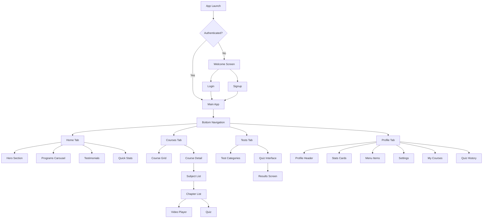

# Passion Academia Mobile App - UI/UX Plan

## Executive Summary

This document outlines the comprehensive UI/UX plan for the Passion Academia Flutter mobile application. The app is an educational platform targeting Pakistani students preparing for:
- Grades 6-12 academic courses
- AFNS (Armed Forces Nursing Services) entrance exams
- PAF Cadet College admissions
- MCJ/MCM (Military College Jhelum/Murree) entrance exams

---

## Current App Analysis

### Existing Structure

```
lib/
├── main.dart                    # App entry point
├── core/
│   └── theme.dart              # AppTheme with light/dark modes
├── models/
│   └── course.dart             # Course, Subject, Question models
├── screens/
│   ├── home/
│   │   └── home_screen.dart    # Main screen with bottom nav
│   ├── course/
│   │   └── course_detail_screen.dart
│   ├── quiz/
│   │   └── quiz_screen.dart    # Quiz with timer & results
│   └── profile/
│       └── profile_screen.dart
└── widgets/
    ├── course_card.dart
    └── subject_card.dart
```

### Current Features
- **Bottom Navigation**: Home, Courses, Tests, Profile
- **Theme Support**: Light/Dark mode with Material 3
- **Quiz System**: Timed quizzes with Urdu/English support
- **Course Browsing**: Horizontal and grid layouts

### Identified Gaps
1. No authentication flow (Login/Signup)
2. No video content player
3. No progress tracking/analytics
4. No offline mode support
5. Limited search functionality
6. No notification system
7. No payment/subscription management

---

## Design System

### Color Palette

| Token | Light Mode | Dark Mode | Usage |
|-------|------------|-----------|-------|
| Primary | `#16A34A` | `#16A34A` | Buttons, accents, highlights |
| Background | `#FFFFFF` | `#020817` | Main background |
| Foreground | `#020817` | `#F8FAFC` | Primary text |
| Secondary | `#F1F5F9` | `#1E293B` | Cards, secondary surfaces |
| Muted | `#64748B` | `#94A3B8` | Secondary text |
| Border | `#E2E8F0` | `#1E293B` | Dividers, borders |
| Error | `#EF4444` | `#EF4444` | Error states |
| Success | `#22C55E` | `#22C55E` | Success states |
| Warning | `#F59E0B` | `#F59E0B` | Warning states |

### Typography

| Style | Font | Size | Weight | Usage |
|-------|------|------|--------|-------|
| Display Large | Inter | 32px | 900 | Hero headlines |
| Headline Large | Inter | 24px | Bold | Section titles |
| Title Large | Inter | 20px | Bold | Card titles |
| Body Large | Inter | 16px | Regular | Primary content |
| Body Medium | Inter | 14px | Regular | Secondary content |
| Label Large | Inter | 14px | 600 | Buttons, labels |
| Urdu Text | Noto Nastaliq Urdu | 18-24px | Regular | Urdu questions |

### Spacing Scale

| Token | Value | Usage |
|-------|-------|-------|
| xs | 4px | Tight spacing |
| sm | 8px | Default padding |
| md | 16px | Card padding |
| lg | 24px | Section spacing |
| xl | 32px | Major sections |
| 2xl | 48px | Hero sections |

### Border Radius

| Token | Value | Usage |
|-------|-------|-------|
| sm | 8px | Small buttons, badges |
| md | 12px | Cards, inputs |
| lg | 16px | Large cards |
| xl | 20px | Modals, sheets |
| full | 9999px | Pills, avatars |

---

## Screen Hierarchy & Navigation

### Navigation Architecture



### Screen Inventory

| Screen | Route | Priority | Description |
|--------|-------|----------|-------------|
| Welcome | `/welcome` | High | Onboarding & auth entry |
| Login | `/login` | High | Email/password login |
| Signup | `/signup` | High | Account creation |
| Home | `/home` | High | Main dashboard |
| Courses | `/courses` | High | All courses grid |
| Course Detail | `/course/:id` | High | Course info & subjects |
| Subject Detail | `/course/:id/subject/:sid` | High | Chapters list |
| Chapter | `/course/:id/subject/:sid/chapter/:cid` | High | Video + quiz |
| Video Player | `/video/:id` | High | Full-screen video |
| Quiz | `/quiz/:subjectId` | High | Interactive quiz |
| Quiz Results | `/quiz/:id/results` | High | Score & review |
| Tests | `/tests` | High | Test prep courses |
| Profile | `/profile` | High | User dashboard |
| Edit Profile | `/profile/edit` | Medium | Update info |
| My Courses | `/my-courses` | Medium | Enrolled courses |
| Quiz History | `/quiz-history` | Medium | Past attempts |
| Achievements | `/achievements` | Low | Badges & rewards |
| Settings | `/settings` | Medium | App preferences |
| Notifications | `/notifications` | Medium | Inbox |
| Search | `/search` | High | Global search |

---

## Component Architecture

### Core Components

#### 1. Navigation Components

```dart
// BottomNavBar - Main navigation
class BottomNavBar extends StatelessWidget {
  final int currentIndex;
  final Function(int) onTap;
  // Home, Courses, Tests, Profile
}

// AppHeader - Custom app bar with branding
class AppHeader extends StatelessWidget implements PreferredSizeWidget {
  final String? title;
  final bool showProfile;
  final List<Widget>? actions;
}

// BackButton - Custom styled back navigation
class CustomBackButton extends StatelessWidget {
  final VoidCallback? onPressed;
}
```

#### 2. Card Components

```dart
// CourseCard - Program display card
class CourseCard extends StatelessWidget {
  final Course course;
  final VoidCallback? onTap;
  final CardSize size; // compact, standard, featured
}

// SubjectCard - Subject within course
class SubjectCard extends StatelessWidget {
  final Subject subject;
  final double progress;
  final VoidCallback? onTap;
}

// ChapterCard - Chapter with video/quiz
class ChapterCard extends StatelessWidget {
  final Chapter chapter;
  final bool isLocked;
  final bool isCompleted;
  final VoidCallback? onTap;
}

// TestimonialCard - Student review
class TestimonialCard extends StatelessWidget {
  final Testimonial testimonial;
}

// StatCard - Quick statistics display
class StatCard extends StatelessWidget {
  final String value;
  final String label;
  final IconData icon;
  final StatCardVariant variant;
}
```

#### 3. Quiz Components

```dart
// QuizTimer - Countdown timer with visual indicator
class QuizTimer extends StatefulWidget {
  final int duration;
  final VoidCallback onTimeout;
}

// QuestionCard - Single question display
class QuestionCard extends StatelessWidget {
  final Question question;
  final int questionNumber;
  final int totalQuestions;
}

// OptionButton - Answer selection button
class OptionButton extends StatelessWidget {
  final String option;
  final String label;
  final bool isSelected;
  final bool isCorrect;
  final bool showResult;
  final VoidCallback onTap;
}

// ProgressBar - Quiz progress indicator
class QuizProgressBar extends StatelessWidget {
  final int current;
  final int total;
}

// ResultsSummary - Quiz completion summary
class ResultsSummary extends StatelessWidget {
  final int score;
  final int totalQuestions;
  final Duration timeTaken;
  final List<QuestionResult> results;
}
```

#### 4. Input Components

```dart
// CustomTextField - Styled text input
class CustomTextField extends StatelessWidget {
  final String label;
  final String? hint;
  final TextInputType keyboardType;
  final bool obscureText;
  final FormFieldValidator<String>? validator;
}

// SearchBar - Global search input
class SearchBar extends StatelessWidget {
  final TextEditingController controller;
  final Function(String) onSearch;
  final List<SearchFilter> filters;
}

// DropdownField - Styled dropdown
class DropdownField<T> extends StatelessWidget {
  final String label;
  final List<T> items;
  final T? value;
  final Function(T?) onChanged;
}
```

#### 5. Feedback Components

```dart
// LoadingOverlay - Full-screen loading
class LoadingOverlay extends StatelessWidget {
  final String? message;
}

// ErrorState - Error display with retry
class ErrorState extends StatelessWidget {
  final String message;
  final VoidCallback? onRetry;
}

// EmptyState - Empty content placeholder
class EmptyState extends StatelessWidget {
  final String title;
  final String? subtitle;
  final IconData icon;
  final VoidCallback? onAction;
}

// Snackbar - Custom styled notifications
class AppSnackbar {
  static void showSuccess(BuildContext context, String message);
  static void showError(BuildContext context, String message);
  static void showInfo(BuildContext context, String message);
}
```

#### 6. Video Components

```dart
// VideoPlayer - Custom video player
class VideoPlayer extends StatefulWidget {
  final String videoUrl;
  final String? thumbnailUrl;
  final Function(Duration)? onProgress;
  final VoidCallback? onComplete;
}

// VideoThumbnail - Preview with play button
class VideoThumbnail extends StatelessWidget {
  final String? thumbnailUrl;
  final Duration duration;
  final double progress;
  final VoidCallback onPlay;
}

// PlaylistView - Video playlist sidebar
class PlaylistView extends StatelessWidget {
  final List<Video> videos;
  final int currentIndex;
  final Function(int) onVideoSelect;
}
```

---

## Screen Specifications

### 1. Welcome Screen

**Purpose**: First-time user onboarding and authentication entry

**Layout**:
- Full-screen gradient background
- Centered logo animation
- Tagline: "Your Gateway to Academic Excellence"
- Two primary CTAs: "Get Started" (Signup) | "I Already Have an Account" (Login)
- Social proof: "Trusted by 10,000+ students"

**Animations**:
- Logo fade-in (500ms)
- Staggered text reveal (300ms delays)
- Button slide-up (400ms)

### 2. Login Screen

**Purpose**: User authentication

**Layout**:
- Back button (top-left)
- "Welcome Back" headline
- Subtitle: "Sign in to continue your learning journey"
- Email input field
- Password input field with visibility toggle
- "Forgot Password?" link
- Primary "Sign In" button
- Divider with "OR"
- Social login: Google, Apple
- "Don't have an account? Sign Up" link

**Validation**:
- Email format validation
- Password minimum 6 characters
- Real-time error display

### 3. Home Screen

**Purpose**: Main dashboard and discovery

**Layout Structure**:
```
[AppHeader with Logo]
[Hero Section]
  - Animated headline
  - Subtitle
  - CTA Button
  - Hero Image
[Quick Stats Row]
  - Courses count
  - Videos count
[Programs Section]
  - Section header with "View All"
  - Horizontal scrolling course cards
[Testimonials Section]
  - Student reviews carousel
```

**Interactions**:
- Pull-to-refresh
- Card tap navigation
- Horizontal scroll snap

### 4. Course Detail Screen

**Purpose**: Course information and subject access

**Layout Structure**:
```
[AppBar with Course Title]
[Hero Banner]
  - Gradient background
  - Course title
  - Description
[Stats Row]
  - Subject count
  - Video count
  - Duration
[Subjects Grid]
  - Subject cards (2 columns)
  - Progress indicators
[CTA Button]
  - "Start Learning" or "Continue"
```

### 5. Quiz Screen

**Purpose**: Interactive assessment

**States**:
1. **Intro State**: Quiz overview, start button
2. **Quiz State**: Question display with timer
3. **Results State**: Score summary with review

**Quiz State Layout**:
```
[Progress Bar]
[Timer Display]
[Question Card]
  - Question number
  - Question text (Urdu/English)
[Options List]
  - 4 selectable options
[Navigation]
  - Previous/Next or Submit
```

**Timer Behavior**:
- 17 seconds per question
- Visual countdown (circular + numeric)
- Auto-advance on timeout
- Color change at 5 seconds (warning)

### 6. Profile Screen

**Purpose**: User account management

**Layout Structure**:
```
[Profile Header]
  - Avatar (editable)
  - Name
  - Email
[Stats Row]
  - XP Points
  - Day Streak
  - Courses Enrolled
[Menu List]
  - My Courses
  - Quiz History
  - Achievements
  - Settings
  - Help & Support
[Logout Button]
```

---

## State Management Plan

### Architecture: Provider + ChangeNotifier

```dart
// Core Providers

// Authentication
class AuthProvider extends ChangeNotifier {
  User? user;
  bool isAuthenticated;
  Future<void> login(String email, String password);
  Future<void> signup(String email, String password, String name);
  Future<void> logout();
}

// Course Data
class CourseProvider extends ChangeNotifier {
  List<Course> courses;
  Course? selectedCourse;
  bool isLoading;
  Future<void> fetchCourses();
  Future<void> fetchCourseDetail(String id);
}

// Quiz State
class QuizProvider extends ChangeNotifier {
  Quiz? currentQuiz;
  int currentQuestionIndex;
  Map<int, int> answers;
  int timeLeft;
  bool isCompleted;
  void startQuiz(Quiz quiz);
  void answerQuestion(int optionIndex);
  void nextQuestion();
  void submitQuiz();
}

// User Progress
class ProgressProvider extends ChangeNotifier {
  UserStats stats;
  List<Achievement> achievements;
  Map<String, double> courseProgress;
  Future<void> fetchProgress();
  void updateVideoProgress(String videoId, double progress);
}

// Theme
class ThemeProvider extends ChangeNotifier {
  ThemeMode mode;
  void toggleTheme();
  void setSystemTheme();
}
```

### Provider Tree

```dart
MultiProvider(
  providers: [
    ChangeNotifierProvider(create: (_) => AuthProvider()),
    ChangeNotifierProvider(create: (_) => ThemeProvider()),
    ChangeNotifierProxyProvider<AuthProvider, CourseProvider>(
      create: (_) => CourseProvider(),
      update: (_, auth, courses) => courses..updateAuth(auth),
    ),
    ChangeNotifierProxyProvider<AuthProvider, ProgressProvider>(
      create: (_) => ProgressProvider(),
      update: (_, auth, progress) => progress..updateAuth(auth),
    ),
    ChangeNotifierProvider(create: (_) => QuizProvider()),
  ],
  child: MyApp(),
)
```

---

## Animation Guidelines

### Transition Animations

| Transition | Type | Duration | Curve |
|------------|------|----------|-------|
| Screen Push | Slide + Fade | 300ms | easeOutCubic |
| Screen Pop | Slide | 250ms | easeInCubic |
| Modal Open | Scale + Fade | 200ms | easeOutBack |
| Modal Close | Fade | 150ms | easeIn |
| Bottom Sheet | Slide Up | 300ms | easeOutQuart |

### Micro-interactions

| Element | Trigger | Animation | Duration |
|---------|---------|-----------|----------|
| Button Press | onTap | Scale 0.95 | 100ms |
| Card Hover | onHover | Elevation + Scale | 200ms |
| Checkbox | onChange | Scale bounce | 150ms |
| Progress Bar | Value change | Width transition | 300ms |
| Timer Warning | < 5s | Pulse + Color | 500ms |
| Success State | Completion | Checkmark draw | 400ms |

### Loading States

```dart
// Skeleton Loading
class SkeletonCard extends StatelessWidget {
  // Shimmer effect for loading states
}

// Loading Spinner
class AppLoader extends StatelessWidget {
  final LoaderSize size;
  final Color? color;
}
```

---

## Responsive Design

### Breakpoints

| Breakpoint | Width | Layout Adjustments |
|------------|-------|-------------------|
| Mobile Small | < 360px | Compact cards, smaller text |
| Mobile | 360-414px | Standard mobile layout |
| Mobile Large | > 414px | Larger touch targets |
| Tablet | > 600px | 2-column grids, side panels |

### Adaptive Layouts

```dart
// Responsive grid
class ResponsiveGrid extends StatelessWidget {
  @override
  Widget build(BuildContext context) {
    final width = MediaQuery.of(context).size.width;
    final crossAxisCount = width > 600 ? 3 : 2;
    return GridView.builder(
      gridDelegate: SliverGridDelegateWithFixedCrossAxisCount(
        crossAxisCount: crossAxisCount,
      ),
    );
  }
}
```

---

## Accessibility Requirements

### Standards Compliance
- WCAG 2.1 Level AA
- Support for screen readers (TalkBack, VoiceOver)
- Minimum touch target: 48x48dp
- Color contrast ratio: 4.5:1 minimum

### Implementation

```dart
// Semantic labels
IconButton(
  icon: Icon(Icons.favorite),
  tooltip: 'Add to favorites',
  onPressed: () {},
)

// High contrast support
Color get adaptiveTextColor {
  return highContrastEnabled 
    ? Colors.black 
    : Theme.of(context).textTheme.bodyLarge?.color;
}

// Text scaling
MediaQuery(
  data: MediaQuery.of(context).copyWith(
    textScaler: TextScaler.linear(
      MediaQuery.of(context).textScaler.scale(1.0).clamp(0.8, 2.0)
    ),
  ),
  child: child,
)
```

---

## Implementation Roadmap

### Phase 1: Foundation (Week 1-2)
- [ ] Set up project structure
- [ ] Implement design system (colors, typography, spacing)
- [ ] Create core components (buttons, cards, inputs)
- [ ] Set up navigation framework
- [ ] Implement theme switching

### Phase 2: Authentication (Week 3)
- [ ] Welcome screen
- [ ] Login screen
- [ ] Signup screen
- [ ] Auth provider implementation
- [ ] Password reset flow

### Phase 3: Core Features (Week 4-5)
- [ ] Home screen with hero section
- [ ] Course listing screens
- [ ] Course detail screen
- [ ] Subject/chapter navigation
- [ ] Search functionality

### Phase 4: Quiz System (Week 6)
- [ ] Quiz intro screen
- [ ] Question display with timer
- [ ] Answer selection
- [ ] Results screen
- [ ] Quiz history

### Phase 5: Video Player (Week 7)
- [ ] Video player integration
- [ ] Playlist view
- [ ] Progress tracking
- [ ] Offline download UI

### Phase 6: Profile & Settings (Week 8)
- [ ] Profile screen
- [ ] Edit profile
- [ ] Settings screen
- [ ] Notification preferences

### Phase 7: Polish (Week 9)
- [ ] Animations and transitions
- [ ] Error states
- [ ] Loading states
- [ ] Empty states
- [ ] Accessibility audit

### Phase 8: Testing & Launch (Week 10)
- [ ] Unit tests
- [ ] Widget tests
- [ ] Integration tests
- [ ] Performance optimization
- [ ] Beta release

---

## Technical Considerations

### Dependencies

```yaml
dependencies:
  flutter:
    sdk: flutter
  
  # UI
  google_fonts: ^6.1.0
  flutter_svg: ^2.0.9
  shimmer: ^3.0.0
  cached_network_image: ^3.3.0
  
  # State Management
  provider: ^6.1.1
  
  # Navigation
  go_router: ^13.0.0
  
  # Video
  video_player: ^2.8.1
  chewie: ^1.7.1
  
  # Storage
  shared_preferences: ^2.2.2
  hive: ^2.2.3
  
  # Network
  dio: ^5.4.0
  connectivity_plus: ^5.0.2
  
  # Utils
  intl: ^0.18.1
  url_launcher: ^6.2.2
  share_plus: ^7.2.1
  
dev_dependencies:
  flutter_test:
    sdk: flutter
  flutter_lints: ^3.0.1
  mockito: ^5.4.4
```

### Performance Targets

| Metric | Target |
|--------|--------|
| App Launch | < 2 seconds |
| Screen Transition | < 300ms |
| List Scroll | 60 FPS |
| Image Load | < 500ms |
| Time to Interactive | < 3 seconds |
| APK Size | < 30 MB |

---

## Appendix

### Asset Naming Convention

```
assets/
├── images/
│   ├── logo.png
│   ├── hero_*.png
│   ├── course_*.png
│   └── icons/
│       ├── ic_*.png
│       └── flag_*.png
├── animations/
│   └── *.json (Lottie)
└── fonts/
    └── (if custom fonts needed)
```

### Route Naming

| Pattern | Example |
|---------|---------|
| Screen | `/login`, `/profile` |
| Detail | `/course/:id` |
| Nested | `/course/:id/subject/:sid` |
| Modal | `/quiz/:id/review` (as modal) |

### Error Codes

| Code | Meaning | User Message |
|------|---------|--------------|
| AUTH_001 | Invalid credentials | "Invalid email or password" |
| AUTH_002 | Session expired | "Please sign in again" |
| NET_001 | No connection | "Check your internet connection" |
| NET_002 | Timeout | "Request timed out. Try again" |
| DATA_001 | Not found | "Content not found" |
| DATA_002 | Server error | "Something went wrong. Try again" |

---

*Document Version: 1.0*
*Last Updated: 2026-02-01*
*Author: Architect Mode*
